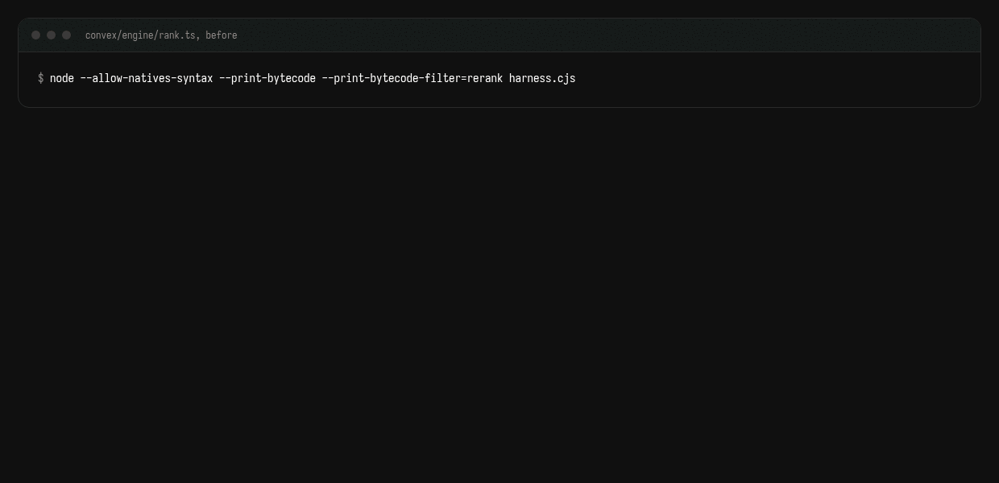
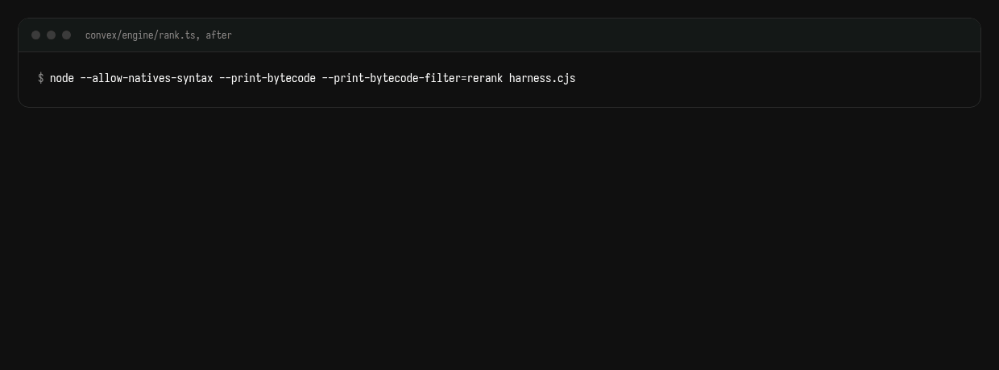
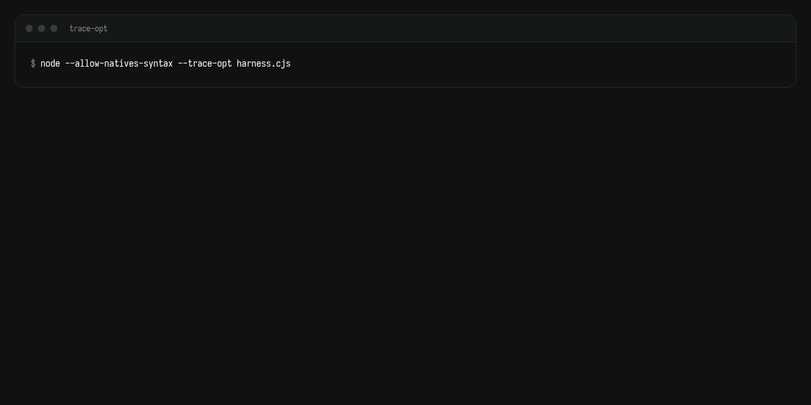
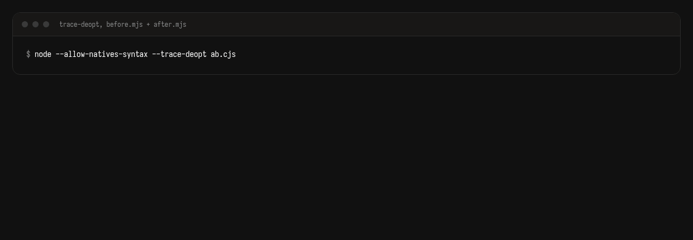

# Real output, before and after

The code and the bytecode V8 actually runs, captured from the repo at PR #10.

<div class="pt-10 font-mono text-xs opacity-60">convex/engine/rank.ts · rerank · 200 candidates</div>

<!--
Everything on these slides is imported from the captured files in presentation/bytecode and presentation/code.
-->

---
layout: default
---

# The code, before

<<< @/code/rank-before.ts ts {lines: false}{maxHeight:'64vh'}

---
layout: default
---

# The code, after

<<< @/code/rank-after.ts ts {lines: false}{maxHeight:'64vh'}

---
layout: default
---

# The bytecode, before

<<< @/bytecode/rerank-before.txt text {maxHeight:'58vh'}

<div class="pt-2 text-sm opacity-70">7 <code>CreateClosure</code> per call, bytecode length 476</div>

---
layout: default
---

# The bytecode, after

<<< @/bytecode/rerank-after.txt text {maxHeight:'58vh'}

<div class="pt-2 text-sm opacity-70">1 <code>CreateClosure</code> per call, bytecode length 1856: the callbacks moved inline</div>

---
layout: default
---

# The census

<div class="grid grid-cols-2 gap-8">
<div>

before

<<< @/bytecode/census-before.txt text

</div>
<div>

after

<<< @/bytecode/census-after.txt text

</div>
</div>

---
layout: default
---

# Opt

<<< @/bytecode/opt-after.txt text {maxHeight:'56vh'}

<div class="pt-2 text-sm opacity-70">Maglev then TurboFan on every hot function, no deopt lines (machine addresses trimmed)</div>

---
layout: default
---

# Deopt

<<< @/bytecode/deopt-ab.txt text {maxHeight:'44vh'}

<div class="pt-2 text-sm opacity-70">Both bundles in one process deoptimized each other. The 16x A/B result was thrown out.</div>

---
layout: default
---

# Animated: before



---
layout: default
---

# Animated: after



---
layout: default
---

# Animated: opt



---
layout: default
---

# Animated: deopt



---
layout: center
class: text-center
---

# Count it. Compile it. Prove it.

```sh
npx skills add Priyansh4444/perf-prove-it
```
